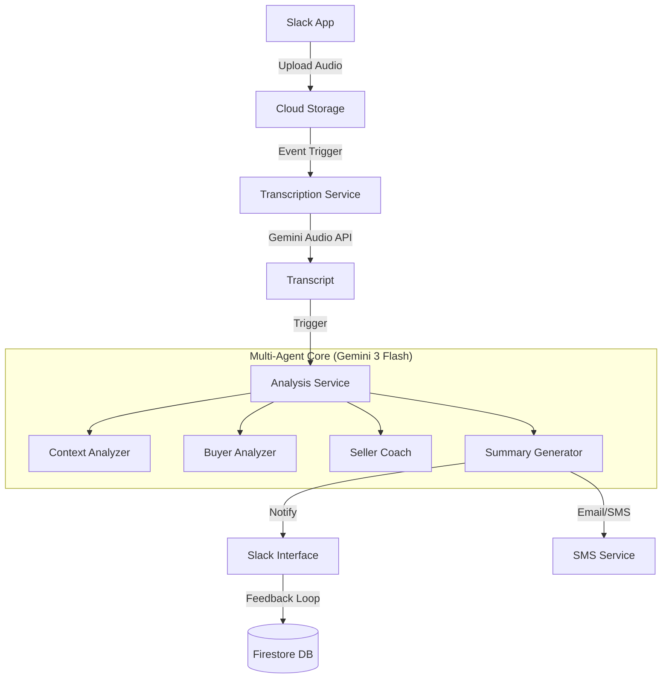

# 🚀 Sales AI Automation System V2.0

## Enterprise-Grade Sales Intelligence Pipeline | Powered by Gemini 3 Flash

[](https://github.com/keweikao/sales-ai-automation-V2)
[](https://github.com/keweikao/sales-ai-automation-V2)
[](https://github.com/keweikao/sales-ai-automation-V2)
[](https://github.com/keweikao/sales-ai-automation-V2)

> **"Turning unstructured sales conversations into actionable business intelligence via Multi-Agent AI."**

This project demonstrates how a **Sales Operations Architect** can build a scalable, low-cost AI pipeline to solve real-world business problems. It integrates **Google Cloud Platform**, **Gemini 3 Flash**, and **Slack** to provide real-time coaching for sales teams.

---

## 💼 The Business Problem

In high-volume sales organizations (like **iCHEF**), manual call reviews are unscalable. Valuable insights—customer objections, competitor mentions, and buying signals—often disappear into a "Data Blackhole."

**The Solution:** An automated pipeline that transcribes, analyzes, and coaches sales reps within minutes of a call ending.

* **Speed:** End-to-end processing in **< 2 minutes**.
* **Cost:** Enterprise-grade analysis for only **~$30/month** (for 100 cases).
* **Experience:** Interactive Slack notifications, not boring dashboards.

---

## 🏗️ System Architecture

The system follows an **Event-Driven Microservices** architecture deployed on **Google Cloud Run**.



### Microservices Breakdown

| Service | Path | Description |
| --- | --- | --- |
| **Slack App** | `src/slack_app/` | Handles user interaction, file ingestion, and interactive Block Kit messages. |
| **Transcription** | `src/transcription/` | High-fidelity transcription using **Gemini Audio API**. |
| **Analysis** | `analysis-service/` | The brain of the system. Orchestrates Multi-Agent reasoning. |
| **SMS Service** | `sms-service/` | Delivers summaries to clients via SMS/Email. |
| **Web Service** | `web-service/` | Renders shareable, professional summary pages for clients. |

---

## 🤖 Multi-Agent Intelligence

Instead of a single giant prompt, the system orchestrates specialized agents to mimic a management team:

| Agent | Role | Model | Responsibility |
| --- | --- | --- | --- |
| **Agent 1** | **Context Analyzer** | `gemini-2.5-flash` | Analyzes meeting context, participant roles, and decision-making power. |
| **Agent 2** | **Buyer Analyzer** | `gemini-2.5-pro` | Decodes buyer psychology, MEDDIC criteria, and hidden objections. |
| **Agent 3** | **Seller Coach** | `gemini-2.5-pro` | Provides specific sales technique recommendations and next-step strategies. |
| **Agent 4** | **Summary Generator** | `gemini-2.5-flash` | Generates client-facing summaries and SMS drafts. |

---

## 🛠️ Tech Stack & Infrastructure

Built with a focus on modern, serverless technologies:

* **Core AI:** Google Gemini 3 Flash Preview (High speed/Low latency)
* **Frameworks:** Flask (v2.2.5), Slack Bolt (v1.18.1)
* **Database:** Firestore (NoSQL for flexible case data)
* **Compute:** Cloud Run (Serverless container execution)
* **Async Tasks:** Cloud Tasks & Pub/Sub

---

## 💰 Cost Optimization (Real-world Data)

As an Ops-focused project, cost efficiency is paramount. Current production metrics for **100 cases/month**:

| Component | Estimated Cost |
| --- | --- |
| **Gemini 3 Flash API** | ~$12.00 / mo |
| **Cloud Run Compute** | ~$15.00 / mo |
| **Firestore Database** | ~$2.00 / mo |
| **Cloud Storage** | ~$1.00 / mo |
| **Total** | **~$30.00 / Month** |

---

## 🚀 Deployment

The project includes `cloudbuild` configurations for CI/CD. To deploy individual services:

```bash
# Deploy Analysis Service
gcloud builds submit --config=cloudbuild.analysis.deploy.yaml

# Deploy Transcription Service
gcloud builds submit --config=cloudbuild.transcription.yaml

```

---

## 📈 Performance Metrics

* **Transcription:** ~1 min for a 10-minute audio file.
* **Analysis:** ~30 seconds (Parallel Agent Execution).
* **Total Latency:** System delivers results to Slack in **< 2 minutes**.

---

## 📂 Project Structure

```text
sales-ai-automation-V2/
├── analysis-service/          # Multi-Agent Core
│   ├── src/agents/            # Agent Definitions & Prompts
│   └── src/main.py            # Orchestrator
├── src/
│   ├── slack_app/             # Slack Interface
│   └── transcription/         # Audio Processing
├── sms-service/               # Notification Service
├── web-service/               # Client Summary Renderer
├── specs/                     # Spec-Driven Development Docs
└── docs/                      # Technical Documentation

```

---

## 👤 Maintainer

**Kewei Kao (Stephen)**

* **Role:** AI Operations Architect | Ex-iCHEF Director of Sales Ops
* **Focus:** Bridging the gap between Business Strategy and AI Implementation.
* **Connect:** [LinkedIn](https://www.linkedin.com/in/kao-ke-wei-18aa6685/)
