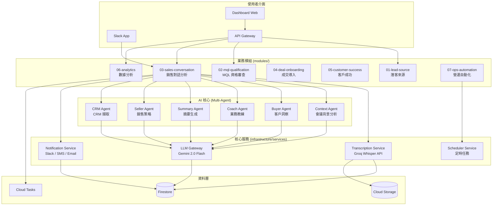

# 🚀 Sales AI Automation System V2.0

## 企業級銷售智能分析平台

[](https://github.com/keweikao/sales-ai-automation-V2)
[](https://python.org)
[](https://fastapi.tiangolo.com)
[](https://groq.com)
[](https://ai.google.dev/gemini-api)
[](https://github.com/keweikao/sales-ai-automation-V2)

> **將非結構化的銷售對話轉化為可執行的商業洞察，透過 Multi-Agent AI 系統實現全流程銷售自動化。**

---

## 📋 目錄

- [系統概述](#系統概述)
- [核心價值](#核心價值)
- [系統架構](#系統架構)
- [專案結構](#專案結構)
- [模組說明](#模組說明)
- [Multi-Agent 系統](#multi-agent-智能系統)
- [技術棧](#技術棧)
- [快速開始](#快速開始)
- [API 文檔](#api-文檔)
- [成本分析](#成本優化)
- [開發指南](#開發指南)
- [文檔索引](#文檔索引)

---

## 系統概述

Sales AI Automation V2 是一個模組化的企業級銷售智能平台，涵蓋從潛客來源到客戶成功的完整銷售週期。系統採用事件驅動微服務架構，結合 Multi-Agent AI 分析引擎，在會議結束後數分鐘內完成轉錄、分析並提供即時教練建議。

### 解決的問題

在高頻率的銷售組織中，人工審查通話記錄無法規模化。客戶異議、競爭對手提及、購買信號等寶貴洞察往往消失在「資料黑洞」中。

---

## 核心價值

| 指標 | 數值 | 說明 |
|------|------|------|
| ⚡ **處理速度** | < 2 分鐘 | 端對端處理時間 (37.5 分鐘音檔 < 10 秒轉錄) |
| 💰 **月成本** | ~$15 | 企業級分析 (300 檔案/月) |
| 🎯 **轉錄準確度** | > 95% | Groq Whisper Large v3 Turbo |
| 📊 **即時反饋** | Slack 通知 | 互動式通知，非枯燥的儀表板 |

---

## 系統架構



---

## 專案結構

```
sales-ai-automation-V2/
│
├── api-gateway/                 # FastAPI API Gateway (統一入口)
│   ├── main.py                  # FastAPI 應用程式
│   ├── routers/                 # API 路由
│   │   ├── conversations.py     # 對話分析 API
│   │   ├── leads.py             # 潛客管理 API
│   │   ├── analytics.py         # 數據分析 API
│   │   └── health.py            # 健康檢查
│   ├── schemas/                 # Pydantic 資料模型
│   ├── services/                # 業務邏輯服務
│   └── middleware/              # 中介軟體
│
├── core/                        # 共用核心模組
│   ├── config/                  # 全域配置管理
│   ├── database/                # 資料庫連線
│   ├── llm/                     # LLM 客戶端封裝
│   ├── plugins/                 # 插件系統
│   ├── schemas/                 # 共用資料模型
│   ├── skills/                  # 可重用技能模組
│   ├── workflows/               # 工作流引擎
│   └── interfaces/              # 抽象介面定義
│
├── modules/                     # 業務模組 (依銷售階段)
│   ├── 01-lead-source/          # 潛客來源管理
│   ├── 02-mql-qualification/    # MQL 資格審查
│   ├── 03-sales-conversation/   # 🎯 銷售對話分析 (核心)
│   │   ├── meddic/              # MEDDIC 方法論
│   │   │   └── agents/          # Multi-Agent 實作
│   │   │       ├── prompts/     # Agent Prompt 模板
│   │   │       ├── context_agent.py
│   │   │       ├── buyer_agent.py
│   │   │       ├── coach_agent.py
│   │   │       ├── seller_agent.py
│   │   │       ├── summary_agent.py
│   │   │       └── crm_agent.py
│   │   ├── transcript_analyzer/ # 轉錄分析協調器
│   │   ├── slack_bot/           # Slack 互動處理
│   │   ├── coaching/            # 教練功能
│   │   └── skills/              # 對話分析技能
│   ├── 04-deal-onboarding/      # 成交導入流程
│   ├── 05-customer-success/     # 客戶成功管理
│   ├── 06-analytics/            # 銷售數據分析
│   └── 07-ops-automation/       # 營運自動化
│
├── infrastructure/              # 基礎設施服務
│   └── services/
│       ├── transcription/       # 轉錄服務 (Groq Whisper)
│       │   ├── providers/       # 轉錄供應商 (Groq/Gemini)
│       │   └── sources/         # 音檔來源適配器
│       ├── notification/        # 通知服務
│       │   ├── channels/        # 通知管道 (Slack/SMS/Email)
│       │   └── templates/       # 通知模板
│       ├── llm_gateway/         # LLM 統一閘道
│       ├── scheduler/           # 定時任務調度
│       ├── learning/            # 機器學習服務
│       └── integration/         # 第三方整合
│
├── dashboard/                   # 前端儀表板 (Turborepo)
│   ├── apps/
│   │   ├── web/                 # 用戶端 Web App
│   │   └── admin/               # 管理後台
│   └── packages/                # 共用 UI 元件
│
├── web-service/                 # 摘要頁面服務
│   ├── src/                     # Flask 應用
│   ├── templates/               # Jinja2 模板
│   └── static/                  # 靜態資源
│
├── docs/                        # 專案文檔
│   ├── architecture/            # 架構設計文檔
│   └── checklists/              # 開發檢查清單
│
├── tests/                       # 測試套件
├── scripts/                     # 開發腳本
├── ops/                         # 運維工具
├── tools/                       # 開發工具
└── templates/                   # 程式碼模板
```

---

## 模組說明

### 業務模組 (`modules/`)

| 模組 | 說明 | 狀態 |
|------|------|------|
| **01-lead-source** | 潛客來源追蹤與管理 | 🔧 開發中 |
| **02-mql-qualification** | MQL 資格審查自動化 | 🔧 開發中 |
| **03-sales-conversation** | 銷售對話分析 (Multi-Agent 核心) | ✅ 生產中 |
| **04-deal-onboarding** | 成交後導入流程 | 📋 規劃中 |
| **05-customer-success** | 客戶成功與續約管理 | 📋 規劃中 |
| **06-analytics** | 銷售數據分析與報表 | 🔧 開發中 |
| **07-ops-automation** | 營運自動化 (週報、提醒) | ✅ 生產中 |

### 基礎設施服務 (`infrastructure/services/`)

| 服務 | 說明 | 技術 |
|------|------|------|
| **transcription** | 音檔轉錄服務 | Groq Whisper API |
| **notification** | 多管道通知服務 | Slack / SMS / Email |
| **llm_gateway** | LLM 統一閘道 | Gemini 2.0 Flash |
| **scheduler** | 定時任務調度 | Cloud Scheduler |
| **learning** | 機器學習服務 | Custom ML |
| **integration** | 第三方整合 | Salesforce / HubSpot |

---

## Multi-Agent 智能系統

系統編排 6 個專門的 AI Agents，模擬完整的銷售管理團隊：

```
modules/03-sales-conversation/meddic/agents/
├── prompts/                     # Prompt 模板 (Markdown)
│   ├── agent1-context.md
│   ├── agent2-buyer.md
│   ├── agent3-seller.md
│   ├── agent4-summary.md
│   └── agent6-crm-extractor.md
├── base.py                      # Agent 基底類別
├── context_agent.py             # Agent 1: 會議背景分析
├── buyer_agent.py               # Agent 2: 客戶洞察
├── seller_agent.py              # Agent 3: 銷售策略
├── coach_agent.py               # Agent 4: 業務教練
├── summary_agent.py             # Agent 5: 摘要生成
└── crm_agent.py                 # Agent 6: CRM 擷取
```

| Agent | 角色 | 職責 |
|-------|------|------|
| **Context Agent** | 會議背景分析師 | 分析會議情境、參與者角色、決策權 |
| **Buyer Agent** | 客戶洞察分析師 | 解碼買家心理、MEDDIC 標準、隱藏異議 |
| **Seller Agent** | 銷售策略師 | 分析銷售策略有效性 |
| **Coach Agent** | 業務教練 | 提供具體銷售技巧建議和下一步策略 |
| **Summary Agent** | 摘要生成專家 | 生成客戶導向的摘要和簡訊草稿 |
| **CRM Agent** | CRM 擷取專家 | 自動擷取 Salesforce 欄位資訊 |

**協調器**: `modules/03-sales-conversation/transcript_analyzer/orchestrator.py`

**關鍵設計**: Agents 從對話語意推斷說話者角色，無需額外的 speaker diarization 處理。

---

## 技術棧

### 後端技術

| 層級 | 技術 | 說明 |
|------|------|------|
| **API 框架** | FastAPI 0.100+ | 統一 API Gateway |
| **微服務框架** | Flask 2.2.5, Slack Bolt | 既有微服務 |
| **轉錄引擎** | Groq Whisper Large v3 Turbo | 228x realtime 速度 |
| **分析引擎** | Gemini 2.0 Flash | 高速低延遲 AI 模型 |
| **資料庫** | Firestore | NoSQL 彈性資料存儲 |
| **運算平台** | Cloud Run | Serverless 容器執行 |
| **非同步任務** | Cloud Tasks | 可靠的任務佇列 |
| **定時任務** | Cloud Scheduler | 週報、提醒調度 |

### 前端技術

| 層級 | 技術 | 說明 |
|------|------|------|
| **Monorepo** | Turborepo | 高效建置系統 |
| **框架** | (待定) | React / Next.js |
| **型別檢查** | TypeScript | 嚴格型別 |

---

## 快速開始

### 先決條件

- Python 3.11+
- GCP 專案 (Cloud Run, Firestore, Cloud Tasks, Cloud Scheduler)
- Groq API Key ([註冊](https://console.groq.com/))
- Gemini API Key ([取得](https://ai.google.dev/gemini-api/docs/api-key))
- Slack Workspace 和 Bot Token

### 本地開發

```bash
# 1. 複製專案
git clone https://github.com/keweikao/sales-ai-automation-V2.git
cd sales-ai-automation-V2

# 2. 建立虛擬環境
python -m venv .venv
source .venv/bin/activate  # macOS/Linux
# .venv\Scripts\activate  # Windows

# 3. 安裝依賴
pip install -e .

# 4. 設定環境變數
cp .env.example .env
# 編輯 .env 填入 API Keys

# 5. 啟動 API Gateway
cd api-gateway
uvicorn main:app --reload --port 8000
```

### 部署至 GCP

```bash
# 設定 Secrets
echo -n "YOUR_GROQ_API_KEY" | gcloud secrets create GROQ_API_KEY --data-file=-
echo -n "YOUR_GEMINI_API_KEY" | gcloud secrets create GEMINI_API_KEY --data-file=-
echo -n "YOUR_SLACK_BOT_TOKEN" | gcloud secrets create slack-bot-token --data-file=-

# 部署 Web Service
gcloud builds submit --config cloudbuild.web-service.yaml

# 驗證服務
gcloud run services list
```

---

## API 文檔

API Gateway 提供以下端點：

| 端點 | 方法 | 說明 |
|------|------|------|
| `/api/v1/health` | GET | 健康檢查 |
| `/api/v1/conversations` | GET/POST | 對話分析管理 |
| `/api/v1/leads` | GET/POST | 潛客管理 |
| `/api/v1/analytics` | GET | 數據分析 |

**互動式文檔**:
- Swagger UI: `http://localhost:8000/api/docs`
- ReDoc: `http://localhost:8000/api/redoc`
- OpenAPI Spec: `http://localhost:8000/api/openapi.json`

---

## 成本優化

**當前生產環境成本** (300 檔案/月):

| 組件 | 月成本 |
|------|--------|
| Groq Whisper API | $7.50 |
| Gemini 2.0 Flash API | ~$5.00 |
| Cloud Run 運算 | ~$2.00 |
| Firestore 資料庫 | ~$0.50 |
| Cloud Storage | ~$0.50 |
| **總計** | **~$15.50 / 月** |

**成本優化成果**:
- 轉錄成本降低 90% (Groq vs Gemini Audio)
- 總體成本降低 50%
- 記憶體使用降低 50% (2Gi → 1Gi)

---

## 開發指南

### 編碼規範

- **回應語言**: 繁體中文
- **Commit 格式**: `feat:`, `fix:`, `docs:`, `refactor:`, `test:`
- **Python 風格**: Black + isort + flake8
- **測試優先**: 所有新功能需附帶測試

### 測試執行

```bash
# 執行所有測試
pytest

# P0 優先測試
pytest -m p0

# 整合測試
pytest -m integration
```

### 開發流程

1. 參考 [DEVELOPMENT_GUIDELINES.md](DEVELOPMENT_GUIDELINES.md)
2. 每次 session 結束前更新 `DEVELOPMENT_LOG.md`
3. 遵循模組化設計原則

---

## 文檔索引

| 文檔 | 說明 |
|------|------|
| [QUICK_START_FOR_AI.md](QUICK_START_FOR_AI.md) | AI 助手快速上手指南 |
| [AI_ARCHITECTURE_ANALYSIS.md](AI_ARCHITECTURE_ANALYSIS.md) | Multi-Agent 架構深度分析 |
| [DEVELOPMENT_GUIDELINES.md](DEVELOPMENT_GUIDELINES.md) | 開發規範與最佳實踐 |
| [DEPLOYMENT_LOG.md](DEPLOYMENT_LOG.md) | 部署歷程記錄 |
| [docs/architecture/](docs/architecture/) | 架構設計文檔 |
| [docs/GROQ_WHISPER_INTEGRATION.md](docs/GROQ_WHISPER_INTEGRATION.md) | Groq Whisper 整合說明 |
| [docs/MCP_BEST_PRACTICES.md](docs/MCP_BEST_PRACTICES.md) | MCP 最佳實踐 |

---

## 維護與監控

### 監控資源

- **Groq Usage**: [console.groq.com/usage](https://console.groq.com/usage)
- **Cloud Run**: [GCP Console](https://console.cloud.google.com/run)
- **Cloud Logging**: `gcloud logging read "resource.labels.service_name=*"`

### 回滾策略

```bash
# 回滾至前一版本
gcloud run services update SERVICE_NAME \
  --revision=REVISION_ID \
  --region=asia-east1
```

---

## 未來規劃

參考 [AI_ARCHITECTURE_ANALYSIS.md](AI_ARCHITECTURE_ANALYSIS.md) 的完整優化建議：

**Phase 1** ✅ 已完成:
- [x] Groq Whisper 整合
- [x] 專案結構重組
- [x] API Gateway 建置

**Phase 2** 🔧 進行中:
- [ ] 全鏈路追蹤 (OpenTelemetry)
- [ ] Dashboard 前端開發
- [ ] 完整模組實作

**Phase 3** 📋 規劃中:
- [ ] Redis 快取層
- [ ] 智能模型路由器
- [ ] A/B 測試框架

---

## 授權

版權所有 © 2025-2026 iCHEF

---

**專案版本**: 2.1.0
**最後更新**: 2026-01-08
**維護者**: Sales Operations Team
