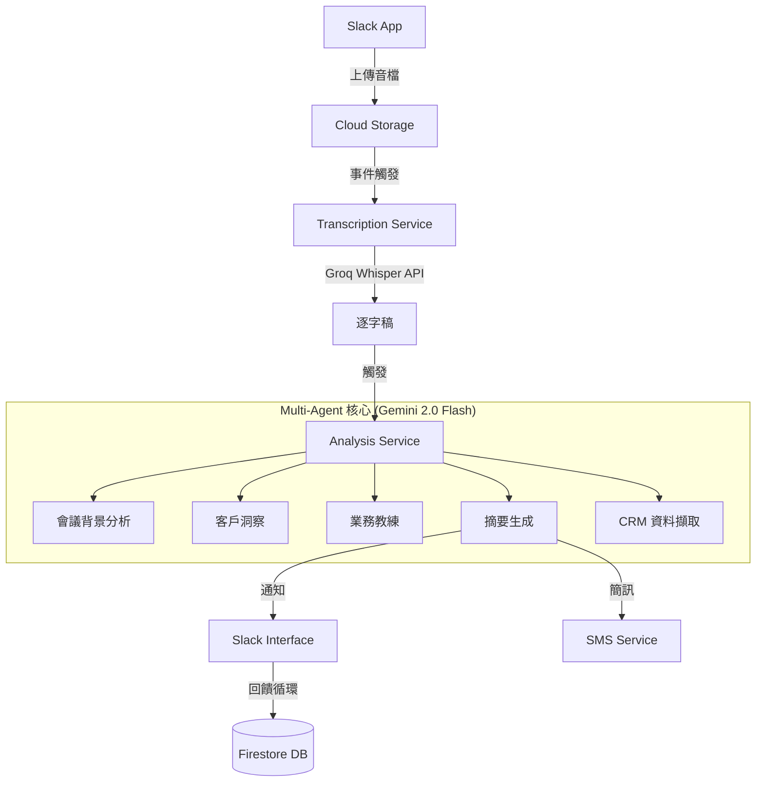

# 🚀 Sales AI Automation System V2.0

## Enterprise-Grade Sales Intelligence Pipeline

[](https://github.com/keweikao/sales-ai-automation-V2)
[](https://groq.com)
[](https://ai.google.dev/gemini-api)
[](https://github.com/keweikao/sales-ai-automation-V2)

> **將非結構化的銷售對話轉化為可執行的商業洞察，透過 Multi-Agent AI 系統。**

自動化轉錄、分析銷售對話，並在會議結束後數分鐘內為業務團隊提供即時教練建議。

---

## 💼 解決的問題

在高頻率的銷售組織中，人工審查通話記錄無法規模化。客戶異議、競爭對手提及、購買信號等寶貴洞察往往消失在「資料黑洞」中。

**解決方案**: 自動化 pipeline，在通話結束後數分鐘內完成轉錄、分析並提供教練建議。

### 核心價值

- ⚡ **速度快**: 端對端處理時間 < 2 分鐘
- 💰 **成本低**: 企業級分析僅需 ~$15/月 (300 檔案)
- 🎯 **準確度高**: Groq Whisper 轉錄準確度 > 95%
- 📊 **即時反饋**: 透過 Slack 互動式通知，非枯燥的儀表板

---

## 🏗️ 系統架構

事件驅動的微服務架構，部署於 Google Cloud Run。



### 微服務拆解

| 服務 | 路徑 | 說明 |
|------|------|------|
| **Slack App** | `src/slack_app/` | 處理使用者互動、檔案上傳、互動式訊息 |
| **Transcription** | `src/transcription/` | 使用 **Groq Whisper API** 進行高精度轉錄 |
| **Analysis** | `analysis-service/` | 系統大腦，協調 Multi-Agent 推理 |
| **SMS Service** | `sms-service/` | 透過簡訊/Email 傳送摘要給客戶 |
| **Web Service** | `web-service/` | 渲染可分享的專業摘要頁面 |

---

## 🤖 Multi-Agent 智能系統

系統編排 6 個專門的 AI Agents，模擬完整的管理團隊：

| Agent | 角色 | 模型 | 職責 |
|-------|------|------|------|
| **Agent 1** | 會議背景分析 | `gemini-2.0-flash` | 分析會議情境、參與者角色、決策權 |
| **Agent 2** | 客戶洞察 | `gemini-2.0-flash` | 解碼買家心理、MEDDIC 標準、隱藏異議 |
| **Agent 3** | 業務教練 | `gemini-2.0-flash` | 提供具體銷售技巧建議和下一步策略 |
| **Agent 4** | 摘要生成 | `gemini-2.0-flash` | 生成客戶導向的摘要和簡訊草稿 |
| **Agent 5** | 即時警示 | `gemini-2.0-flash` | 偵測關鍵警訊並即時通知 |
| **Agent 6** | CRM 擷取 | `gemini-2.0-flash` | 自動擷取 CRM 相關資訊 |

**關鍵設計**: Agents 從對話語意推斷說話者角色，無需額外的 speaker diarization 處理。

---

## 🛠️ 技術棧

| 層級 | 技術 | 說明 |
|------|------|------|
| **轉錄引擎** | Groq Whisper (Large v3 Turbo) | 228x realtime 速度，95%+ 準確度 |
| **分析引擎** | Gemini 2.0 Flash | 高速低延遲的 AI 模型 |
| **後端框架** | Flask 2.2.5, Slack Bolt | 微服務框架 |
| **資料庫** | Firestore | NoSQL 彈性資料存儲 |
| **運算平台** | Cloud Run | Serverless 容器執行 |
| **非同步任務** | Cloud Tasks | 可靠的任務佇列 |
| **監控** | Cloud Logging | 集中式日誌管理 |

---

## 💰 成本優化 (實際數據)

**當前生產環境成本** (300 檔案/月):

| 組件 | 月成本 |
|------|--------|
| **Groq Whisper API** | $7.50 |
| **Gemini 2.0 Flash API** | ~$5.00 |
| **Cloud Run 運算** | ~$2.00 |
| **Firestore 資料庫** | ~$0.50 |
| **Cloud Storage** | ~$0.50 |
| **總計** | **~$15.50 / 月** |

**與舊架構比較**:

- 轉錄成本降低 90% (Groq vs Gemini Audio)
- 總體成本降低 50%
- 記憶體使用降低 50% (2Gi vs 4Gi)

---

## 📦 快速開始

### 先決條件

- GCP 專案 (需啟用 Cloud Run, Firestore, Cloud Tasks)
- Groq API Key ([註冊](https://console.groq.com/))
- Gemini API Key ([取得](https://ai.google.dev/gemini-api/docs/api-key))
- Slack Workspace 和 Bot Token

### 部署步驟

詳細步驟請參考 [QUICK_START_FOR_AI.md](QUICK_START_FOR_AI.md)。

**核心步驟**:

1. **設定 Secrets**

   ```bash
   # Groq API Key
   echo -n "YOUR_GROQ_API_KEY" | gcloud secrets create GROQ_API_KEY --data-file=-

   # Gemini API Key
   echo -n "YOUR_GEMINI_API_KEY" | gcloud secrets create GEMINI_API_KEY --data-file=-

   # Slack Bot Token
   echo -n "YOUR_SLACK_BOT_TOKEN" | gcloud secrets create slack-bot-token --data-file=-
   ```

2. **部署服務**

   ```bash
   # 部署 Transcription Service (Groq Whisper)
   gcloud builds submit --config cloudbuild.transcription-groq.yaml

   # 部署 Analysis Service (Gemini Multi-Agent)
   gcloud builds submit --config cloudbuild.analysis.deploy.yaml

   # 部署 Slack App
   gcloud builds submit --config cloudbuild.slack.yaml
   ```

3. **驗證部署**

   ```bash
   # 檢查服務狀態
   gcloud run services list
   ```

---

## 📊 專案結構

```
sales-ai-automation-V2/
├── src/
│   ├── slack_app/              # Slack 互動介面
│   └── transcription/          # Groq Whisper 轉錄服務
├── analysis-service/           # Multi-Agent 分析服務
│   └── src/agents/prompts/     # 6 個 Agent 提示詞
├── sms-service/                # 簡訊發送服務
├── web-service/                # 摘要頁面服務
├── docs/                       # 完整文檔
│   ├── GROQ_WHISPER_INTEGRATION.md
│   ├── GROQ_QUICKSTART.md
│   └── GROQ_IMPLEMENTATION_SUMMARY.md
├── cloudbuild.*.yaml           # Cloud Build 配置
└── .github/workflows/          # GitHub Actions CI/CD
```

---

## 📚 文檔

- **快速開始**: [QUICK_START_FOR_AI.md](QUICK_START_FOR_AI.md)
- **Groq Whisper 整合**: [docs/GROQ_WHISPER_INTEGRATION.md](docs/GROQ_WHISPER_INTEGRATION.md)
- **架構分析**: [AI_ARCHITECTURE_ANALYSIS.md](AI_ARCHITECTURE_ANALYSIS.md)
- **部署日誌**: [DEPLOYMENT_LOG.md](DEPLOYMENT_LOG.md)
- **開發指南**: [DEVELOPMENT_GUIDELINES.md](DEVELOPMENT_GUIDELINES.md)
- **Agent 設計**: [AGENTS.md](AGENTS.md)

---

## 🎯 關鍵特色

### 1. Groq Whisper 整合 (2026-01-07)

- ✅ **228x realtime 速度**: 37.5 分鐘音檔 < 10 秒處理
- ✅ **95%+ 準確度**: Traditional Chinese 高精度轉錄
- ✅ **穩定性**: 無 Gemini 幻覺問題
- ✅ **成本效益**: $7.50/月 vs Gemini 變動成本

### 2. 語意推斷說話者

Agent 從對話內容自動推斷說話者角色，無需額外的 speaker diarization：

- 客戶：詢問價格、功能、表達顧慮
- 業務：介紹產品、詢問需求、提供方案

### 3. 事件驅動架構

- Cloud Tasks 非同步處理
- Firestore 狀態持久化
- Slack 即時通知

---

## 🔧 維護與監控

### 監控儀表板

- **Groq Usage**: [console.groq.com/usage](https://console.groq.com/usage)
- **Cloud Run**: [GCP Console](https://console.cloud.google.com/run)
- **Cloud Logging**: `gcloud logging read "resource.labels.service_name=transcription-service"`

### 回滾策略

如需回滾到 Gemini 轉錄：

```bash
gcloud run services update transcription-service \
  --set-env-vars=TRANSCRIPTION_ENGINE=gemini \
  --region=asia-east1
```

---

## 🚀 未來優化

參考 [AI_ARCHITECTURE_ANALYSIS.md](AI_ARCHITECTURE_ANALYSIS.md) 的完整優化建議：

**Phase 1 (已完成)**:

- [x] Groq Whisper 整合 (2026-01-07)

**Phase 2 (規劃中)**:

- [ ] API Gateway 統一入口
- [ ] 全鏈路追蹤 (OpenTelemetry)
- [ ] Redis 快取層
- [ ] 智能模型路由器

---

## 📝 變更日誌

詳細變更記錄請參考 [CHANGELOG.md](CHANGELOG.md)。

**最新更新 (2026-01-07)**:

- ✅ Groq Whisper API 整合
- ✅ 移除 Faster-Whisper 和 STT pipelines
- ✅ Agent prompts 優化（語意推斷說話者）
- ✅ 專案結構清理

---

## 🤝 貢獻

本專案為私有企業專案，暫不接受外部貢獻。

---

## 📄 授權

版權所有 © 2025-2026 iCHEF

---

**專案版本**: 2.0.0-groq-whisper
**最後更新**: 2026-01-07
**維護者**: Sales Operations Team
