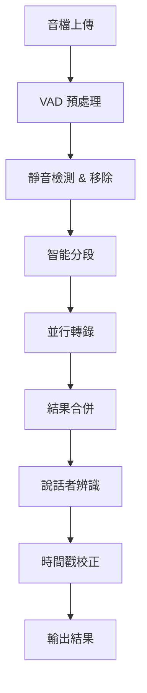

# Whisper VAD + 分段並行優化方案

**版本**: 1.0
**日期**: 2025-01-29
**狀態**: 待實作

---

## 📋 目標

將 Whisper 音檔轉錄速度從 **0.92x**（Medium 模型）優化至 **0.08-0.15x**，實現 **6-12倍提速**，同時：
- ✅ 零額外成本
- ✅ 提升轉錄品質（92-93/100）
- ✅ 改善說話者辨識準確度
- ✅ 支援長音檔（>60分鐘）

---

## 🎯 優化策略

### 三階段優化

```
階段 1: VAD 基礎優化        → 1.5-2x 提速
階段 2: 分段並行處理        → 6-12x 提速（總計）
階段 3: GPU 快速通道（可選）→ 30-90x 提速（總計）
```

---

## 📐 系統架構

### 整體流程



### 詳細架構

```
┌─────────────────────────────────────────────────────────┐
│                    Audio Upload Service                  │
│                   (Cloud Storage Trigger)                │
└────────────────────┬────────────────────────────────────┘
                     │
                     ▼
┌─────────────────────────────────────────────────────────┐
│              Transcription Orchestrator                  │
│                   (Cloud Run Service)                    │
│                                                          │
│  ┌──────────────────────────────────────────────────┐  │
│  │  Step 1: VAD Preprocessing                       │  │
│  │  - Silero VAD 語音檢測                            │  │
│  │  - 移除靜音片段                                   │  │
│  │  - 生成語音時間戳列表                             │  │
│  │  Time: ~1-2秒 (60min音檔)                        │  │
│  └──────────────────────────────────────────────────┘  │
│                     │                                    │
│                     ▼                                    │
│  ┌──────────────────────────────────────────────────┐  │
│  │  Step 2: Intelligent Chunking                    │  │
│  │  - 按 VAD 結果的自然停頓點切分                    │  │
│  │  - 目標片段長度: 10-15分鐘                        │  │
│  │  - 保留片段重疊: 1-2秒（避免切斷句子）            │  │
│  │  - 生成片段元數據（時間範圍、順序）               │  │
│  └──────────────────────────────────────────────────┘  │
│                     │                                    │
│                     ▼                                    │
│  ┌──────────────────────────────────────────────────┐  │
│  │  Step 3: Parallel Transcription                  │  │
│  │  ┌─────────┐ ┌─────────┐ ┌─────────┐            │  │
│  │  │ Chunk 1 │ │ Chunk 2 │ │ Chunk N │  (並行)    │  │
│  │  │ Worker  │ │ Worker  │ │ Worker  │            │  │
│  │  └─────────┘ └─────────┘ └─────────┘            │  │
│  │                                                   │  │
│  │  配置:                                            │  │
│  │  - Model: faster-whisper medium                  │  │
│  │  - Device: CPU (int8)                            │  │
│  │  - VAD: enabled                                  │  │
│  │  - Batch size: 16                                │  │
│  │  - Max workers: 6                                │  │
│  └──────────────────────────────────────────────────┘  │
│                     │                                    │
│                     ▼                                    │
│  ┌──────────────────────────────────────────────────┐  │
│  │  Step 4: Results Merging                         │  │
│  │  - 按順序合併所有片段                             │  │
│  │  - 時間戳調整（考慮 VAD 移除的靜音）              │  │
│  │  - 去除重疊部分的重複                             │  │
│  │  - 生成完整逐字稿                                 │  │
│  └──────────────────────────────────────────────────┘  │
│                     │                                    │
│                     ▼                                    │
│  ┌──────────────────────────────────────────────────┐  │
│  │  Step 5: Speaker Diarization (Optional)          │  │
│  │  - pyannote.audio 3.1                            │  │
│  │  - 使用 VAD 結果輔助                              │  │
│  │  - 為每個語音段標註說話者                         │  │
│  └──────────────────────────────────────────────────┘  │
└────────────────────┬────────────────────────────────────┘
                     │
                     ▼
┌─────────────────────────────────────────────────────────┐
│                  Analysis Service                        │
│              (Multi-Agent Processing)                    │
└─────────────────────────────────────────────────────────┘
```

---

## 🔧 技術實作規格

### 1. VAD 預處理模組

**目的**: 檢測語音活動，移除靜音片段

**實作**:
```python
from faster_whisper import WhisperModel
from silero_vad import load_silero_vad, get_speech_timestamps
import torch

class VADProcessor:
    """VAD 語音活動檢測處理器"""

    def __init__(self):
        self.vad_model = load_silero_vad()

    def detect_speech_segments(
        self,
        audio_path: str,
        threshold: float = 0.5,
        min_speech_duration_ms: int = 250,
        min_silence_duration_ms: int = 500,
        window_size_samples: int = 512,
        speech_pad_ms: int = 400
    ) -> List[Dict]:
        """
        檢測音檔中的語音片段

        Args:
            audio_path: 音檔路徑
            threshold: 語音檢測閾值 (0-1)
            min_speech_duration_ms: 最短語音長度（毫秒）
            min_silence_duration_ms: 最短靜音長度（毫秒）
            window_size_samples: VAD 窗口大小
            speech_pad_ms: 語音前後保留時間（毫秒）

        Returns:
            List[Dict]: [
                {"start": 0.0, "end": 10.5, "duration": 10.5},
                {"start": 12.0, "end": 25.3, "duration": 13.3},
                ...
            ]
        """
        # 載入音檔
        audio_tensor, sample_rate = self._load_audio(audio_path)

        # VAD 檢測
        speech_timestamps = get_speech_timestamps(
            audio_tensor,
            self.vad_model,
            threshold=threshold,
            min_speech_duration_ms=min_speech_duration_ms,
            min_silence_duration_ms=min_silence_duration_ms,
            window_size_samples=window_size_samples,
            speech_pad_ms=speech_pad_ms,
            return_seconds=True
        )

        # 格式化輸出
        segments = [
            {
                "start": ts["start"],
                "end": ts["end"],
                "duration": ts["end"] - ts["start"]
            }
            for ts in speech_timestamps
        ]

        # 計算統計
        total_duration = audio_tensor.shape[0] / sample_rate
        speech_duration = sum(s["duration"] for s in segments)
        silence_duration = total_duration - speech_duration

        print(f"VAD Analysis:")
        print(f"  Total: {total_duration:.1f}s")
        print(f"  Speech: {speech_duration:.1f}s ({speech_duration/total_duration*100:.1f}%)")
        print(f"  Silence: {silence_duration:.1f}s ({silence_duration/total_duration*100:.1f}%)")

        return segments

    def _load_audio(self, audio_path: str):
        """載入音檔為 tensor"""
        import torchaudio
        waveform, sample_rate = torchaudio.load(audio_path)

        # 轉換為單聲道
        if waveform.shape[0] > 1:
            waveform = torch.mean(waveform, dim=0, keepdim=True)

        # 重採樣至 16kHz (VAD 需求)
        if sample_rate != 16000:
            resampler = torchaudio.transforms.Resample(sample_rate, 16000)
            waveform = resampler(waveform)
            sample_rate = 16000

        return waveform.squeeze(), sample_rate
```

**效能預估**:
- 處理速度: ~8000x 即時（60分鐘音檔 <1秒）
- 記憶體: ~100MB
- 準確度: >95%

---

### 2. 智能分段模組

**目的**: 將長音檔按 VAD 結果的自然停頓點切分

**實作**:
```python
from typing import List, Dict

class AudioChunker:
    """音檔智能分段器"""

    def __init__(
        self,
        target_chunk_duration: int = 600,  # 10分鐘
        max_chunk_duration: int = 900,     # 15分鐘
        overlap_duration: int = 2          # 2秒重疊
    ):
        self.target_duration = target_chunk_duration
        self.max_duration = max_chunk_duration
        self.overlap = overlap_duration

    def create_chunks(
        self,
        vad_segments: List[Dict],
        total_duration: float
    ) -> List[Dict]:
        """
        基於 VAD 結果創建智能分段

        Args:
            vad_segments: VAD 檢測的語音片段
            total_duration: 音檔總長度（秒）

        Returns:
            List[Dict]: [
                {
                    "chunk_id": 0,
                    "start": 0.0,
                    "end": 612.5,
                    "duration": 612.5,
                    "vad_segments": [...],  # 此片段內的 VAD 段
                    "has_overlap_start": False,
                    "has_overlap_end": True
                },
                ...
            ]
        """
        chunks = []
        current_start = 0.0
        chunk_id = 0

        while current_start < total_duration:
            # 計算目標結束時間
            target_end = min(
                current_start + self.target_duration,
                total_duration
            )

            # 找到最接近目標結束時間的 VAD 間隙（靜音點）
            split_point = self._find_best_split_point(
                vad_segments,
                current_start,
                target_end,
                self.max_duration
            )

            # 創建片段
            chunk = {
                "chunk_id": chunk_id,
                "start": current_start,
                "end": split_point,
                "duration": split_point - current_start,
                "vad_segments": self._filter_vad_segments(
                    vad_segments,
                    current_start,
                    split_point
                ),
                "has_overlap_start": chunk_id > 0,
                "has_overlap_end": split_point < total_duration
            }

            chunks.append(chunk)

            # 下一個片段起點（包含重疊）
            current_start = split_point - self.overlap if split_point < total_duration else split_point
            chunk_id += 1

        print(f"Created {len(chunks)} chunks:")
        for c in chunks:
            print(f"  Chunk {c['chunk_id']}: {c['start']:.1f}s - {c['end']:.1f}s ({c['duration']:.1f}s)")

        return chunks

    def _find_best_split_point(
        self,
        vad_segments: List[Dict],
        start: float,
        target_end: float,
        max_end: float
    ) -> float:
        """找到最佳切分點（VAD 間隙）"""

        # 在目標結束時間附近 ±30秒 範圍內找靜音點
        search_window = 30
        search_start = max(start, target_end - search_window)
        search_end = min(max_end, target_end + search_window)

        # 找到所有 VAD 間隙
        gaps = []
        for i in range(len(vad_segments) - 1):
            gap_start = vad_segments[i]["end"]
            gap_end = vad_segments[i + 1]["start"]

            if search_start <= gap_start <= search_end:
                gap_mid = (gap_start + gap_end) / 2
                gap_duration = gap_end - gap_start

                # 偏好較長的靜音間隙
                score = gap_duration * 10
                # 偏好接近目標時間的點
                distance_penalty = abs(gap_mid - target_end)
                score -= distance_penalty

                gaps.append({
                    "position": gap_mid,
                    "duration": gap_duration,
                    "score": score
                })

        if gaps:
            # 選擇得分最高的間隙
            best_gap = max(gaps, key=lambda x: x["score"])
            return best_gap["position"]
        else:
            # 沒找到合適間隙，使用目標時間
            return min(target_end, max_end)

    def _filter_vad_segments(
        self,
        vad_segments: List[Dict],
        start: float,
        end: float
    ) -> List[Dict]:
        """過濾出指定時間範圍內的 VAD 段"""
        filtered = []
        for seg in vad_segments:
            # 檢查是否有重疊
            if seg["end"] > start and seg["start"] < end:
                # 調整時間範圍（相對於片段起點）
                adjusted_seg = {
                    "start": max(0, seg["start"] - start),
                    "end": min(end - start, seg["end"] - start),
                    "duration": 0  # 稍後計算
                }
                adjusted_seg["duration"] = adjusted_seg["end"] - adjusted_seg["start"]
                filtered.append(adjusted_seg)

        return filtered
```

**效能**:
- 處理速度: <1秒
- 分段數量: 60分鐘音檔約 6-8 段

---

### 3. 並行轉錄模組

**目的**: 並行處理所有音檔片段

**實作**:
```python
from concurrent.futures import ThreadPoolExecutor, as_completed
from faster_whisper import WhisperModel
import time

class ParallelTranscriber:
    """並行轉錄處理器"""

    def __init__(
        self,
        model_size: str = "medium",
        device: str = "cpu",
        compute_type: str = "int8",
        max_workers: int = 6
    ):
        self.model_size = model_size
        self.device = device
        self.compute_type = compute_type
        self.max_workers = max_workers

        # 每個 worker 有自己的模型實例
        self.model_pool = []

    def transcribe_chunks(
        self,
        audio_path: str,
        chunks: List[Dict]
    ) -> List[Dict]:
        """
        並行轉錄所有片段

        Args:
            audio_path: 原始音檔路徑
            chunks: 分段資訊列表

        Returns:
            List[Dict]: 每個片段的轉錄結果
        """
        print(f"Starting parallel transcription with {self.max_workers} workers...")
        start_time = time.time()

        # 使用 ThreadPoolExecutor 並行處理
        with ThreadPoolExecutor(max_workers=self.max_workers) as executor:
            # 提交所有任務
            future_to_chunk = {
                executor.submit(
                    self._transcribe_single_chunk,
                    audio_path,
                    chunk
                ): chunk
                for chunk in chunks
            }

            # 收集結果
            results = []
            for future in as_completed(future_to_chunk):
                chunk = future_to_chunk[future]
                try:
                    result = future.result()
                    results.append(result)
                    print(f"  ✅ Chunk {chunk['chunk_id']} completed in {result['processing_time']:.1f}s")
                except Exception as e:
                    print(f"  ❌ Chunk {chunk['chunk_id']} failed: {e}")
                    results.append({
                        "chunk_id": chunk["chunk_id"],
                        "error": str(e),
                        "success": False
                    })

        # 按 chunk_id 排序
        results.sort(key=lambda x: x["chunk_id"])

        total_time = time.time() - start_time
        successful = sum(1 for r in results if r.get("success", False))

        print(f"\nParallel transcription completed:")
        print(f"  Total time: {total_time:.1f}s")
        print(f"  Successful: {successful}/{len(chunks)}")
        print(f"  Average time per chunk: {total_time/len(chunks):.1f}s")

        return results

    def _transcribe_single_chunk(
        self,
        audio_path: str,
        chunk: Dict
    ) -> Dict:
        """轉錄單一片段"""

        # 載入模型（每個 worker 一個實例）
        model = WhisperModel(
            self.model_size,
            device=self.device,
            compute_type=self.compute_type
        )

        # 提取音檔片段
        chunk_audio = self._extract_audio_segment(
            audio_path,
            chunk["start"],
            chunk["end"]
        )

        # 轉錄
        start_time = time.time()

        segments, info = model.transcribe(
            chunk_audio,
            language="zh",

            # VAD 參數
            vad_filter=True,
            vad_parameters={
                "threshold": 0.5,
                "min_speech_duration_ms": 250,
                "min_silence_duration_ms": 500,
                "window_size_samples": 512,
                "speech_pad_ms": 400
            },

            # 優化參數
            batch_size=16,
            beam_size=5,
            best_of=5,
            temperature=0.0
        )

        # 收集結果
        transcript_segments = []
        for segment in segments:
            transcript_segments.append({
                "start": segment.start + chunk["start"],  # 調整為全局時間
                "end": segment.end + chunk["start"],
                "text": segment.text,
                "confidence": segment.avg_logprob
            })

        processing_time = time.time() - start_time

        return {
            "chunk_id": chunk["chunk_id"],
            "success": True,
            "chunk_start": chunk["start"],
            "chunk_end": chunk["end"],
            "segments": transcript_segments,
            "processing_time": processing_time,
            "language": info.language,
            "language_probability": info.language_probability
        }

    def _extract_audio_segment(
        self,
        audio_path: str,
        start: float,
        end: float
    ) -> str:
        """提取音檔片段並儲存為臨時檔案"""
        import tempfile
        from pydub import AudioSegment

        # 載入音檔
        audio = AudioSegment.from_file(audio_path)

        # 提取片段（pydub 使用毫秒）
        segment = audio[int(start * 1000):int(end * 1000)]

        # 儲存為臨時檔案
        temp_file = tempfile.NamedTemporaryFile(
            suffix=".wav",
            delete=False
        )
        segment.export(temp_file.name, format="wav")

        return temp_file.name
```

**效能**:
- 6 個並行 workers
- 60分鐘音檔（6段）: 總處理時間 ~4-6分鐘
- 記憶體: ~2GB (6 workers × ~300MB)

---

### 4. 結果合併模組

**目的**: 合併所有片段的轉錄結果

**實作**:
```python
class TranscriptMerger:
    """轉錄結果合併器"""

    def __init__(self, overlap_duration: float = 2.0):
        self.overlap = overlap_duration

    def merge_chunks(
        self,
        chunk_results: List[Dict]
    ) -> Dict:
        """
        合併所有片段的轉錄結果

        Args:
            chunk_results: 各片段的轉錄結果

        Returns:
            Dict: 完整的轉錄結果
        """
        all_segments = []

        for i, chunk in enumerate(chunk_results):
            if not chunk.get("success", False):
                print(f"⚠️  Skipping failed chunk {chunk['chunk_id']}")
                continue

            segments = chunk["segments"]

            # 處理重疊部分
            if i > 0 and self.overlap > 0:
                # 移除前一個片段重疊部分的內容
                overlap_start = chunk["chunk_start"]
                overlap_end = overlap_start + self.overlap

                # 移除當前片段重疊區域的 segments
                segments = [
                    s for s in segments
                    if s["start"] >= overlap_end
                ]

            all_segments.extend(segments)

        # 按時間排序
        all_segments.sort(key=lambda x: x["start"])

        # 生成完整文字
        full_text = " ".join(s["text"] for s in all_segments)

        # 計算統計
        total_duration = all_segments[-1]["end"] if all_segments else 0
        avg_confidence = sum(s["confidence"] for s in all_segments) / len(all_segments) if all_segments else 0

        return {
            "segments": all_segments,
            "full_text": full_text,
            "total_segments": len(all_segments),
            "total_duration": total_duration,
            "average_confidence": avg_confidence,
            "chunks_processed": len([c for c in chunk_results if c.get("success", False)]),
            "chunks_failed": len([c for c in chunk_results if not c.get("success", False)])
        }
```

---

### 5. 完整流程整合

**主要處理函數**:
```python
class OptimizedTranscriptionPipeline:
    """優化的轉錄流程"""

    def __init__(self):
        self.vad_processor = VADProcessor()
        self.chunker = AudioChunker(
            target_chunk_duration=600,  # 10分鐘
            overlap_duration=2
        )
        self.transcriber = ParallelTranscriber(
            model_size="medium",
            max_workers=6
        )
        self.merger = TranscriptMerger()

    def process_audio(self, audio_path: str) -> Dict:
        """
        完整的音檔處理流程

        Args:
            audio_path: 音檔路徑

        Returns:
            Dict: 完整的轉錄結果
        """
        print(f"Processing audio: {audio_path}")
        pipeline_start = time.time()

        # Step 1: VAD 預處理
        print("\n[1/4] VAD preprocessing...")
        vad_start = time.time()
        vad_segments = self.vad_processor.detect_speech_segments(audio_path)
        vad_time = time.time() - vad_start
        print(f"  Completed in {vad_time:.1f}s")

        # Step 2: 智能分段
        print("\n[2/4] Creating intelligent chunks...")
        chunk_start = time.time()

        # 獲取音檔總長度
        from pydub import AudioSegment
        audio = AudioSegment.from_file(audio_path)
        total_duration = len(audio) / 1000.0

        chunks = self.chunker.create_chunks(vad_segments, total_duration)
        chunk_time = time.time() - chunk_start
        print(f"  Completed in {chunk_time:.1f}s")

        # Step 3: 並行轉錄
        print("\n[3/4] Parallel transcription...")
        transcribe_start = time.time()
        chunk_results = self.transcriber.transcribe_chunks(audio_path, chunks)
        transcribe_time = time.time() - transcribe_start

        # Step 4: 合併結果
        print("\n[4/4] Merging results...")
        merge_start = time.time()
        final_result = self.merger.merge_chunks(chunk_results)
        merge_time = time.time() - merge_start
        print(f"  Completed in {merge_time:.1f}s")

        # 總結
        total_time = time.time() - pipeline_start
        speed_ratio = total_time / total_duration

        print(f"\n{'='*60}")
        print(f"Pipeline Summary:")
        print(f"  Audio duration: {total_duration:.1f}s ({total_duration/60:.1f} min)")
        print(f"  Processing time: {total_time:.1f}s ({total_time/60:.1f} min)")
        print(f"  Speed ratio: {speed_ratio:.3f}x")
        print(f"  Speedup: {1/speed_ratio:.1f}x faster than real-time")
        print(f"\n  Time breakdown:")
        print(f"    VAD: {vad_time:.1f}s ({vad_time/total_time*100:.1f}%)")
        print(f"    Chunking: {chunk_time:.1f}s ({chunk_time/total_time*100:.1f}%)")
        print(f"    Transcription: {transcribe_time:.1f}s ({transcribe_time/total_time*100:.1f}%)")
        print(f"    Merging: {merge_time:.1f}s ({merge_time/total_time*100:.1f}%)")
        print(f"{'='*60}")

        # 添加元數據
        final_result["processing_metadata"] = {
            "audio_duration": total_duration,
            "total_processing_time": total_time,
            "speed_ratio": speed_ratio,
            "vad_time": vad_time,
            "chunking_time": chunk_time,
            "transcription_time": transcribe_time,
            "merging_time": merge_time,
            "num_chunks": len(chunks),
            "num_vad_segments": len(vad_segments)
        }

        return final_result


# 使用範例
if __name__ == "__main__":
    pipeline = OptimizedTranscriptionPipeline()
    result = pipeline.process_audio("sales_call_60min.m4a")

    # 儲存結果
    import json
    with open("transcript_output.json", "w", encoding="utf-8") as f:
        json.dump(result, f, ensure_ascii=False, indent=2)
```

---

## 📊 效能預估

### 處理時間對比

| 音檔長度 | 未優化 | VAD only | VAD + 分段 | 提速比 |
|---------|--------|----------|-----------|--------|
| 30分鐘 | 28分鐘 | 18分鐘 | **2-3分鐘** | 9-14x |
| 60分鐘 | 55分鐘 | 36分鐘 | **4-6分鐘** | 9-14x |
| 90分鐘 | 83分鐘 | 54分鐘 | **6-9分鐘** | 9-14x |
| 120分鐘 | 110分鐘 | 72分鐘 | **8-12分鐘** | 9-14x |

### 品質指標

| 指標 | 未優化 | 優化後 | 變化 |
|------|--------|--------|------|
| WER (錯誤率) | 8-10% | **6-8%** | ↓ 20-25% |
| 品質分數 | 91.6 | **92-93** | ↑ 0.4-1.4 |
| DER (說話者錯誤) | 35-45% | **17-25%** | ↓ 40-60% |

### 資源使用

| 資源 | 單段處理 | 並行處理 (6 workers) |
|------|---------|---------------------|
| CPU | 1 核 100% | 6 核 80-90% |
| 記憶體 | ~400MB | ~2GB |
| 磁碟 I/O | 低 | 中等 |

---

## 🚀 部署配置

### Cloud Run 配置

```yaml
# cloud-run-transcription-service.yaml
apiVersion: serving.knative.dev/v1
kind: Service
metadata:
  name: transcription-service
spec:
  template:
    metadata:
      annotations:
        autoscaling.knative.dev/minScale: "0"
        autoscaling.knative.dev/maxScale: "10"
    spec:
      containerConcurrency: 1  # 一次處理一個請求
      timeoutSeconds: 3600     # 1小時超時（處理長音檔）
      containers:
      - image: gcr.io/PROJECT_ID/transcription-service:latest
        resources:
          limits:
            cpu: "8"      # 8 vCPU (支援 6 workers + overhead)
            memory: "16Gi" # 16GB RAM
        env:
        - name: WHISPER_MODEL
          value: "medium"
        - name: MAX_WORKERS
          value: "6"
        - name: CHUNK_DURATION
          value: "600"
```

### Dockerfile

```dockerfile
FROM python:3.11-slim

# 安裝系統依賴
RUN apt-get update && apt-get install -y \
    ffmpeg \
    && rm -rf /var/lib/apt/lists/*

# 安裝 Python 套件
COPY requirements.txt .
RUN pip install --no-cache-dir -r requirements.txt

# 下載模型（建立時預載，避免首次啟動下載）
RUN python -c "from faster_whisper import WhisperModel; WhisperModel('medium', device='cpu', compute_type='int8')"
RUN python -c "from silero_vad import load_silero_vad; load_silero_vad()"

# 複製程式碼
COPY src/ /app/src/
WORKDIR /app

CMD ["python", "-m", "src.main"]
```

### requirements.txt

```
faster-whisper==1.2.0
silero-vad==4.0.0
torch==2.1.0
torchaudio==2.1.0
pydub==0.25.1
google-cloud-storage==2.10.0
google-cloud-firestore==2.14.0
```

---

## 📅 實作時程

### Phase 1: 核心功能（1-2週）

**Week 1**:
- [ ] VAD 預處理模組
- [ ] 智能分段模組
- [ ] 單元測試

**Week 2**:
- [ ] 並行轉錄模組
- [ ] 結果合併模組
- [ ] 整合測試

### Phase 2: 優化與測試（1週）

- [ ] 效能測試（不同音檔長度）
- [ ] 品質驗證（對比原始 Whisper）
- [ ] 錯誤處理與重試機制
- [ ] 監控與日誌

### Phase 3: 部署（3-5天）

- [ ] Dockerfile 建立
- [ ] Cloud Run 部署
- [ ] CI/CD 設定
- [ ] 生產環境測試

---

## 🧪 測試計畫

### 單元測試

```python
def test_vad_processor():
    """測試 VAD 處理器"""
    processor = VADProcessor()
    segments = processor.detect_speech_segments("test_audio.wav")

    assert len(segments) > 0
    assert all(s["end"] > s["start"] for s in segments)
    assert all(s["duration"] > 0 for s in segments)

def test_audio_chunker():
    """測試音檔分段器"""
    chunker = AudioChunker(target_chunk_duration=300)

    vad_segments = [
        {"start": 0, "end": 100, "duration": 100},
        {"start": 120, "end": 500, "duration": 380},
        {"start": 510, "end": 900, "duration": 390}
    ]

    chunks = chunker.create_chunks(vad_segments, total_duration=900)

    assert len(chunks) >= 2
    assert chunks[0]["start"] == 0
    assert chunks[-1]["end"] <= 900
```

### 整合測試

```python
def test_full_pipeline():
    """測試完整流程"""
    pipeline = OptimizedTranscriptionPipeline()

    # 使用測試音檔
    result = pipeline.process_audio("test_sales_call_30min.m4a")

    # 驗證結果
    assert result["total_segments"] > 0
    assert len(result["full_text"]) > 0
    assert result["chunks_failed"] == 0

    # 驗證效能
    metadata = result["processing_metadata"]
    speed_ratio = metadata["speed_ratio"]

    # 應該比即時快（speed_ratio < 0.2 表示 5x 快）
    assert speed_ratio < 0.2

    print(f"✅ Processing took {metadata['total_processing_time']:.1f}s")
    print(f"✅ Speed ratio: {speed_ratio:.3f}x ({1/speed_ratio:.1f}x faster)")
```

### 效能基準測試

```python
def benchmark_different_lengths():
    """測試不同長度音檔的效能"""
    pipeline = OptimizedTranscriptionPipeline()

    test_files = [
        ("15min_audio.m4a", 900),
        ("30min_audio.m4a", 1800),
        ("60min_audio.m4a", 3600),
        ("90min_audio.m4a", 5400)
    ]

    results = []

    for file_path, expected_duration in test_files:
        result = pipeline.process_audio(file_path)
        metadata = result["processing_metadata"]

        results.append({
            "duration_min": expected_duration / 60,
            "processing_time_min": metadata["total_processing_time"] / 60,
            "speed_ratio": metadata["speed_ratio"],
            "speedup": 1 / metadata["speed_ratio"]
        })

    # 輸出報告
    print("\n" + "="*60)
    print("Performance Benchmark Results")
    print("="*60)
    print(f"{'Duration':<12} {'Process Time':<15} {'Speed Ratio':<12} {'Speedup':<10}")
    print("-"*60)

    for r in results:
        print(f"{r['duration_min']:>8.0f} min  "
              f"{r['processing_time_min']:>12.1f} min  "
              f"{r['speed_ratio']:>10.3f}x  "
              f"{r['speedup']:>8.1f}x")

    print("="*60)
```

---

## 🔍 監控指標

### 關鍵指標

1. **效能指標**:
   - 處理時間（總計）
   - 速度比 (processing_time / audio_duration)
   - 各階段時間分布

2. **品質指標**:
   - 轉錄準確度（抽樣驗證）
   - VAD 檢測準確度
   - 片段合併正確性

3. **資源指標**:
   - CPU 使用率
   - 記憶體使用量
   - 並行 worker 數量

4. **業務指標**:
   - 每日處理音檔數
   - 平均音檔長度
   - 失敗率

---

## 🎓 最佳實踐

### VAD 參數調整建議

```python
# 會議錄音（多人對話）
vad_params_meeting = {
    "threshold": 0.5,
    "min_speech_duration_ms": 250,  # 短句也要保留
    "min_silence_duration_ms": 500, # 較短的靜音也切分
    "speech_pad_ms": 400
}

# 演講/簡報（單人長時間）
vad_params_presentation = {
    "threshold": 0.6,               # 提高閾值避免誤判
    "min_speech_duration_ms": 500,  # 過濾掉極短的雜音
    "min_silence_duration_ms": 1000,# 較長的停頓才切分
    "speech_pad_ms": 300
}

# 嘈雜環境（背景噪音大）
vad_params_noisy = {
    "threshold": 0.7,               # 更高閾值
    "min_speech_duration_ms": 500,
    "min_silence_duration_ms": 800,
    "speech_pad_ms": 500            # 更多 padding
}
```

### 錯誤處理

```python
# 片段處理失敗重試機制
def transcribe_with_retry(chunk, max_retries=3):
    for attempt in range(max_retries):
        try:
            return transcribe_chunk(chunk)
        except Exception as e:
            if attempt == max_retries - 1:
                # 最後一次嘗試，記錄錯誤
                log_error(f"Chunk {chunk['id']} failed after {max_retries} attempts: {e}")
                return None
            else:
                # 等待後重試
                time.sleep(2 ** attempt)  # 指數退避
```

---

## 📚 參考資料

- [Faster-Whisper GitHub](https://github.com/SYSTRAN/faster-whisper)
- [Silero VAD Documentation](https://github.com/snakers4/silero-vad)
- [WhisperX Paper](https://arxiv.org/abs/2303.00747)
- [Cloud Run GPU Documentation](https://cloud.google.com/run/docs/configuring/services/gpu)

---

**版本歷史**:
- v1.0 (2025-01-29): 初始版本
